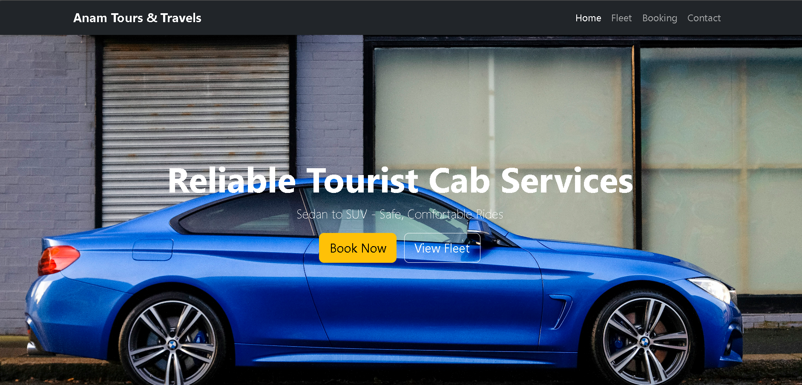
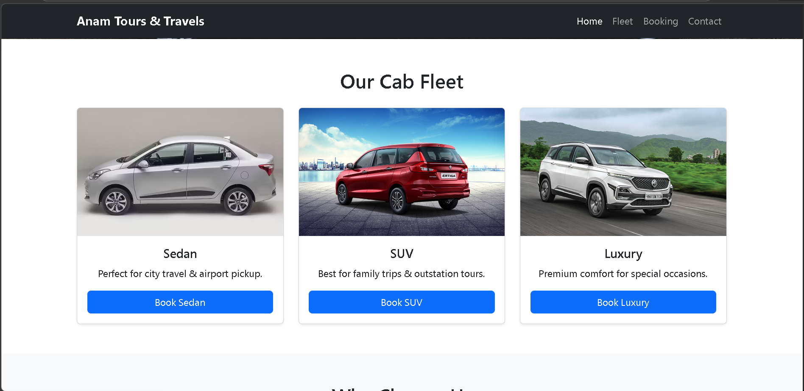
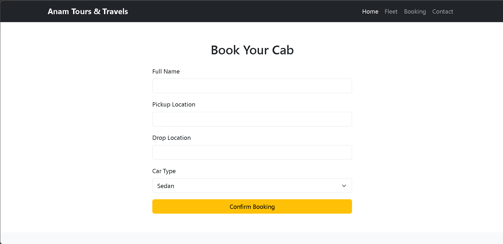
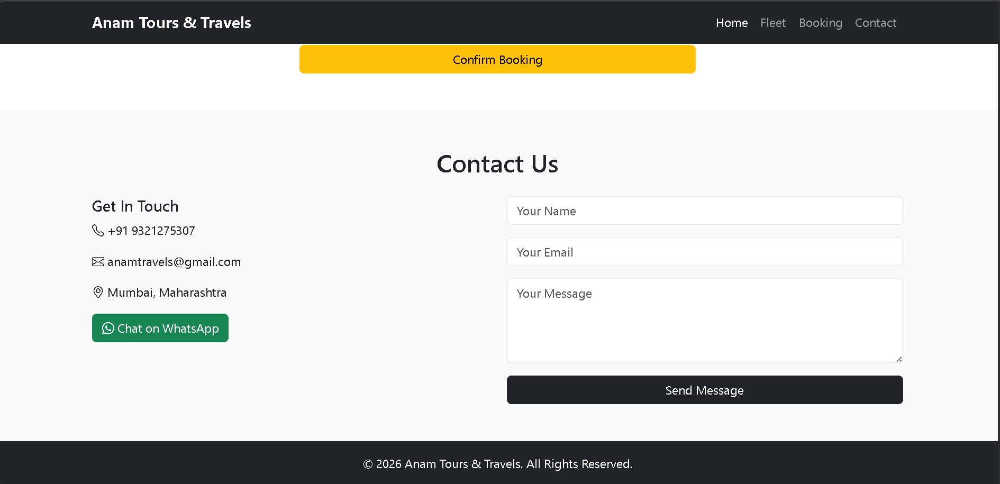

# Anam Tours & Travels Website

A responsive Tours & Travels website built using Bootstrap 5 to practice responsive web design and custom CSS.

Live Demo: https://imranhabib123.github.io/Tours-Travels-Responsive-website/

## Purpose

This project was created to learn Bootstrap layout system, responsive design techniques, and custom CSS styling.

## Technologies Used

* HTML5
* CSS3
* Bootstrap 5
* Bootstrap Icons

## Features

* Responsive Navigation Bar
* Hero Section
* Cab Fleet Section (Sedan, SUV, Luxury)
* Booking Form
* Pickup and Drop Location Fields
* Car Type Selection
* WhatsApp Booking Enquiry
* Contact Section
* Responsive Layout for different screen sizes

## Project Structure

```
project-folder
│
├── index.html
├── style.css
└── Images
```

## Screenshots






## Future Improvements

* JavaScript form validation
* Email booking enquiry
* Booking data storage
* Backend integration
* Admin dashboard

## Author

Imran Shaikh
